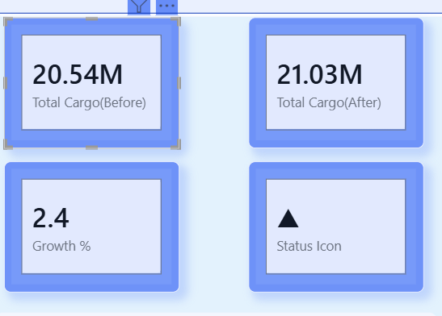

# 🚢 Supply Chain Cargo Analysis Dashboard
### by Vikash Kumar | Data Analyst

> **End-to-end data analysis project** — Measuring the impact of supply chain disruptions on cargo flow across 4 major Indian ports using PostgreSQL, SQL, and Power BI.

---

## 🎥 Live Demo
👉 **[Watch Full Dashboard Walkthrough on YouTube](https://youtu.be/vhWI5-4j-qk)**

---

## 📌 Problem Statement

Supply chain disruptions cause significant shifts in cargo flow at major ports. This project investigates:
- How did cargo volume change **before vs after** disruption?
- Which ports were most affected?
- What cargo types saw the biggest impact?
- How did **incoming vs outgoing** trade balance shift?

---

## 📊 Dashboard Screenshots

### 🔹 Main KPI Overview

### 🔹 Supply Chain Cargo Analysis

### 🔹 Cargo Type Distribution

### 🔹 Cargo Type vs Cargo Value
.png)

### 🔹 Incoming vs Outgoing Analysis

### 🔹 Incoming vs Outgoing (Before & After)
.png)

### 🔹 Port Cargo Comparison
.png)

### 🔹 Trade Balance by Port

### 🔹 Flow Disruption Impact

---

## 🔑 Key Insights

| Metric | Before Disruption | After Disruption | Change |
|--------|:-----------------:|:----------------:|:------:|
| Total Cargo | 20.54M | 21.03M | ▲ +2.4% |
| Incoming Cargo | 13M | 12M | ▼ -7.6% |
| Outgoing Cargo | 8M | 9M | ▲ +12.5% |
| Tanker Volume | 4M | 5M | ▲ +25% |
| Mumbai Total | — | — | 32.1M |

### 📍 Port-wise Summary
| Port | After Disruption | Before Disruption | Total |
|------|:----------------:|:-----------------:|:-----:|
| Mumbai | 16,448,780 | 15,676,836 | 32,125,616 |
| Madras | 2,383,775 | 3,284,572 | 5,668,347 |
| Kochi | 2,135,287 | 1,506,508 | 3,641,795 |
| Kolkata | 63,068 | 76,436 | 139,504 |

### 🏆 Top Findings
- **Mumbai** handled the highest cargo volume across all ports
- **Container cargo** dominates at **65.62%** of total cargo mix
- **Tanker volume** surged by **25%** post-disruption
- **Outgoing cargo** grew while **incoming cargo** declined — indicating export push
- Overall cargo grew **2.4%** despite the disruption event

---

## 🛠 Tech Stack

| Tool | Purpose |
|------|---------|
| PostgreSQL | Database design & data storage |
| SQL | Data cleaning, joins, aggregation |
| Power BI | Interactive dashboards & visualization |

---

## 📁 Project Structure
